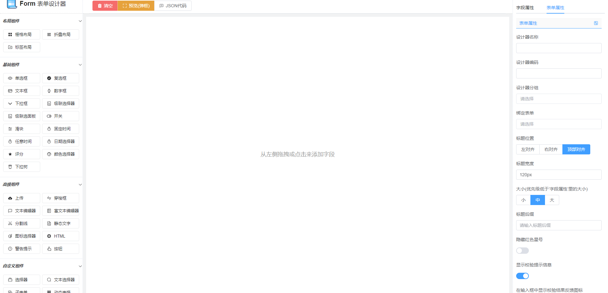
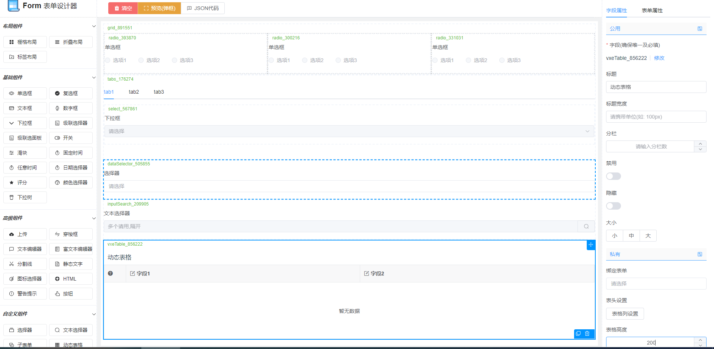
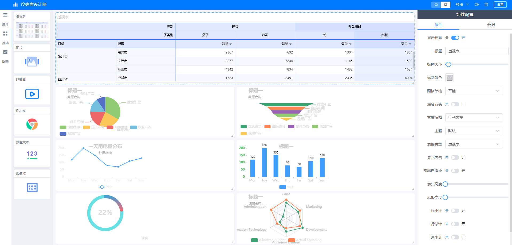
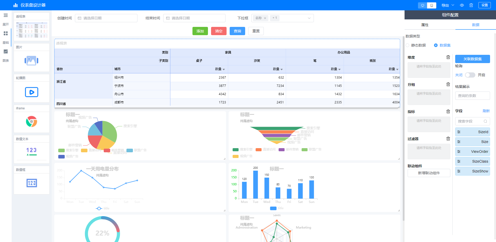
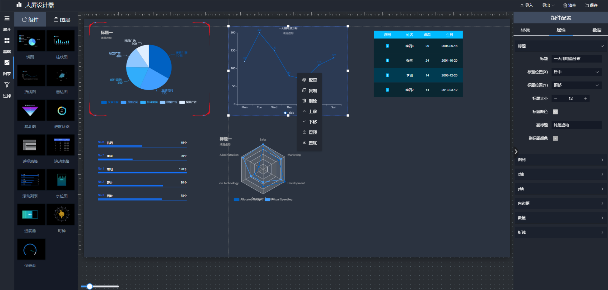
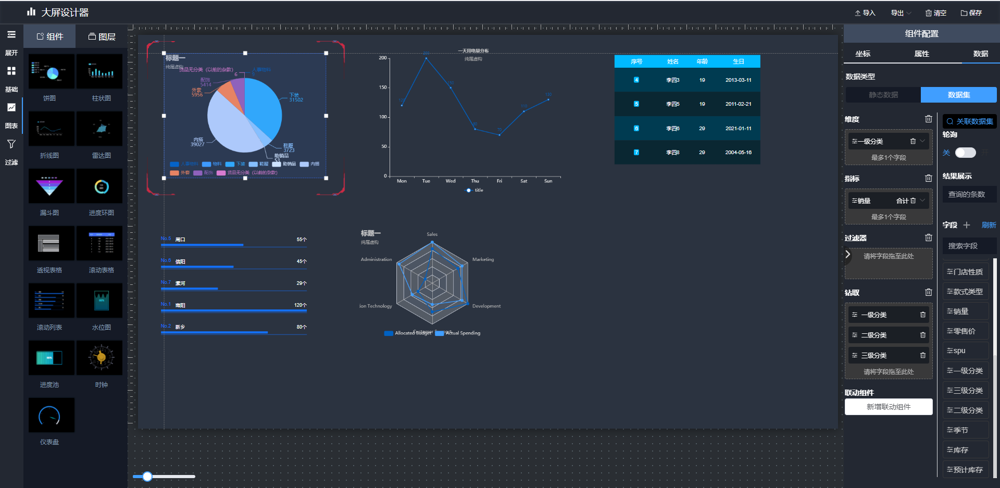
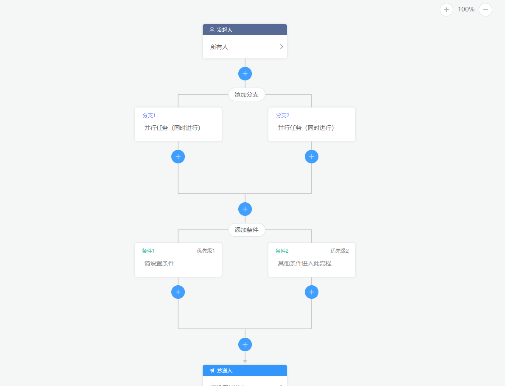
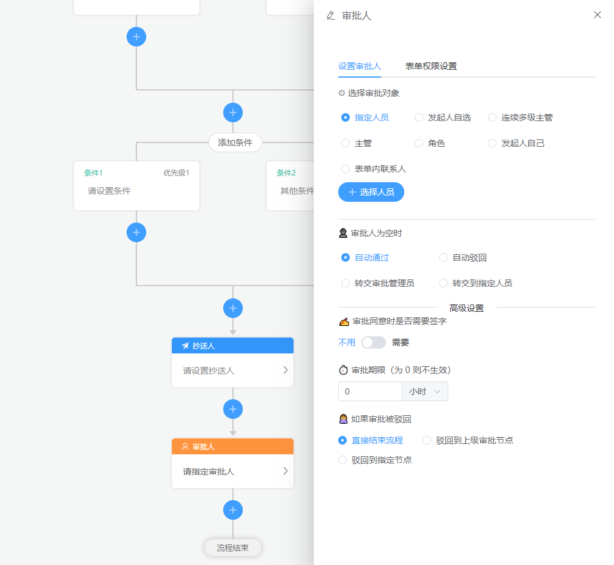
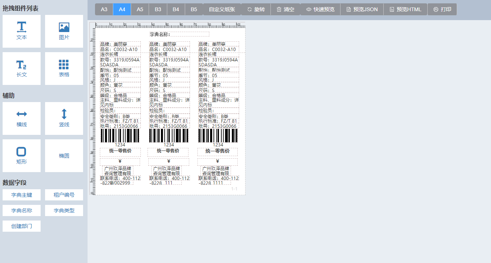

# vform-designer

#### 介绍

Vue3.0 版本,基于 element-plus 表单设计器

#### 软件架构

软件架构说明

#### 安装教程

pnpm i
<br>
pnpm run dev

#### 使用说明

import { pringSchema, SchemaForm, FormDesign } from "eform-designer"
<br>
import "eform-designer/dist/designer.style.css" //引入样式
<br>
可以在 main 中全局引用
app.use(SchemaForm).use(FormDesign)

### 效果图

<br>

<br>
<br>
<br>

<br>

### 目前已发布低代码平台

<br>
官网介绍：[传送门](http://38.147.173.55)
<br>
多租户低代码体验：[演示](http://38.147.173.55:8008)
<br>
多应用低代码体验：[演示](http://38.147.173.55:8088)
<br>
更多交流反馈欢迎加入QQ群: 780382507
<br>

### 仪表盘效果图

1.  设计器：
    import { PanelDesign } from "panel-designer"
    <br>
    import "panel-designer/dist/designer.style.css" //引入样式
    <br>
    ```
    <PanelDesign ref="panelRef">
      <template #headerBut>
        <el-button size="small" @click="preview" style="margin-left: 20px; background: #49586e; color: #fff">
          预览
        </el-button>
        <el-button size="small" type="success" @click="submitDesign" style="margin-left: 20px">保存</el-button>
      </template>
    </PanelDesign>
    ```
2.  预览：
    import { PanelPreview } from "panel-designer"
    <br>
    import "panel-designer/dist/designer.style.css" //引入样式
    <br>
    `   <PanelPreview ref="panelViewRef" :panelData="panelData" />`
    <br>
    
    <br>
    <br>
    <br>
    
    <br>

### 大屏效果图

1.  设计器：
    import { ScreenDesign } from "large-screen-designer"
    <br>
    import "large-screen-designer/dist/designer.style.css" //引入样式
    <br>

    ```
    <ScreenDesign ref="screenRef" :screenData="screenData" @submitDesign="submitDesign">
      <template #headerBut>
        <el-button size="small" @click="preview" style="margin-left: 20px; background: #49586e; color: #fff">
          预览
        </el-button>
      </template>
    </PanelDesign>
    // 或者 保存 @submitDesign 都可以
    async function submitDesign() {
      // 调用子组件方法
      const designData = await screenRef.value.submitDesign()
      // 这个可以获取到ScreenDesign对应的数据JSON
    }
    ```

2.  预览：
    import { ScreenPreview } from "large-screen-designer"
    <br>
    import "large-screen-designer/dist/designer.style.css" //引入样式
    <br>
    ```
      <ScreenPreview ref="screenViewRef" :screenData="screenData" />
    ```
    <br>
    
    <br>
    <br>
    <br>
    
    <br>

### 仿钉钉流程图

1.  设计器：
    import { setGetOrgTreeMethod, setGetUserByNameMethod, ProcessDesign } from "wflow-designer";
    <br>
    import "wflow-designer/dist/designer.style.css"; // 引入样式
    <br>

    ```
    // 可以自定义设置api接口 如
    // 这是我本地接口
    import { deptTreeSelect } from "@/api/system/user/index";
    // 将api对应的接口赋值给包对应的方法 包会调用当前接口
    setGetOrgTreeMethod(deptTreeSelect);
    获取用户数据就会自动去调用这个api接口 接口的返回类型为
    type为dept为部门,type为user为用户 需要拼接成这样的数组
    [{avatar: null
      id: "1486186"
      isLeader: null
      name: "xx 科技有限公司"
      selected: false
      sex: null
      type: "dept"},{avatar: null
      id: "1486186"
      isLeader: null
      name: "xx张三"
      selected: false
      sex: null
      type: "user"}]
    setGetUserByNameMethod方法也一样 这个是根据搜索名称去获取信息而已
    // 引用
    <ProcessDesign ref="flowComp" />
    // 初始化树状
    config为树状数据JSON 可修改传入 如：
    flowComp.value.config = {
      id: "root",
      parentId: null,
      type: "ROOT",
      name: "发起人",
      desc: "任何人",
      props: { assignedUser: [], formPerms: [] },
      children: {},
    };
    ```

2.  预览：
    <br>
    
    <br>
    <br>
    <br>
    
    <br>    

### 在线打印设置
1. 安装
 npm install vue-hirpint

 import { hiprint, defaultElementTypeProvider, customData, customPrintJson } from "vue-hirpint"
2.  预览：
    <br>
    
    <br>
    <br>

#### 交流

QQ 群：780382507

#### 参与贡献

1.  Fork 本仓库
2.  新建 Feat_xxx 分支
3.  提交代码
4.  新建 Pull Request

#### 特技

1.  使用 Readme_XXX.md 来支持不同的语言，例如 Readme_en.md, Readme_zh.md
2.  Gitee 官方博客 [blog.gitee.com](https://blog.gitee.com)
3.  你可以 [https://gitee.com/explore](https://gitee.com/explore) 这个地址来了解 Gitee 上的优秀开源项目
4.  [GVP](https://gitee.com/gvp) 全称是 Gitee 最有价值开源项目，是综合评定出的优秀开源项目
5.  Gitee 官方提供的使用手册 [https://gitee.com/help](https://gitee.com/help)
6.  Gitee 封面人物是一档用来展示 Gitee 会员风采的栏目 [https://gitee.com/gitee-stars/](https://gitee.com/gitee-stars/)
